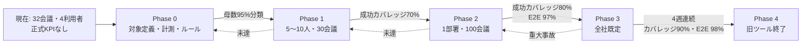

# KPIバックキャストロードマップ

## 現在のベースライン

- タスク: 社内tl;dv利用をカボスへ全面移行するためのKPIと段階計画。
- 現状: 日本語UIと主要会議処理は稼働しているが、対象会議母数とE2E SLOがない。稼働DBは32会議・4ユーザーで、確定文字起こし成功7、Drive成功0。
- 確認済みの制約: 開発・検証会議が混在。会議実行はMac上のDockerが中心。現行tl;dv利用実態は未取得。
- 未確認事項: 対象利用者数、対象会議数、旧ツール費用、必須機能、録音例外、過去データ量。
- ベースラインの証拠: 稼働PostgreSQL集計、Docker一覧、Cloud Run応答、GitHub Issue、repo内設計・計画。

## カテゴリ別の将来KPI

| カテゴリ | 将来KPI | 現在値 | 測定方法 | 証跡 | 責任者・システム | 確信度 |
|---|---|---|---|---|---|---|
| カバレッジ | 対象会議成功カバレッジ90%以上を4週 | 対象母数なし | 成果物成功会議/対象会議 | KPIダッシュボード | プロダクト責任者 | 中 |
| 導入 | 週次対象利用者率85%以上 | 30日4ユーザー | 作成/閲覧ユーザー/対象者 | 利用イベント | パイロット責任者 | 中 |
| 置き換え | 旧ツール残存率5%未満 | 未計測 | 併用・代替会議/対象会議 | 週次申告・連携ログ | プロダクト責任者 | 低 |
| 信頼性 | 参加成功率・E2E成功率98%以上 | 完了29/32の粗い状態のみ | 段階イベント | 運用ダッシュボード | 技術運用責任者 | 中 |
| 速度 | 確定版15分以内95%以上 | 成功7、待機7、失敗5 | 終了→公開時刻 | ジョブログ | meeting-api | 中 |
| 品質 | 成果物受入率90%以上 | 未計測 | 再処理/全面修正なし | 評価UI | 利用者 | 低 |
| 話者 | 60分会議の確認中央値90秒以内 | #31 PoC未完 | 修正開始→完了 | dashboardイベント | 利用者 | 中 |
| 活用 | 7日以内閲覧率70%以上 | 未計測 | opened/published | dashboard/Drive | プロダクト責任者 | 低 |
| 可用性 | 月間99.5%以上、MTTR60分以内 | 単一Mac中心 | 合成SLOとインシデント | 監視 | 技術運用責任者 | 中 |
| データ保全 | 復元不能消失0、適合率100% | 保持設計あり、復元SLOなし | 復元試験、監査 | 証跡パック | 情報管理責任者 | 中 |
| コスト | 1会議時間単価が旧ツール以下 | 旧ツール費用不明 | 総費用/対象会議時間 | 月次費用表 | 管理者 | 低 |

## KPIの現実性確認

| KPI | 現実的な理由 | 見せかけの目標になる条件 | 情報源・証拠 |
|---|---|---|---|
| カバレッジ90% | 正当な例外を分母から分離しつつ、既定運用を要求できる | 全会議100%と置き、拒否・機密会議を無視する | 対象会議定義をPhase 0で作る |
| E2E成功98% | 旧ツール停止に必要な水準で、週次サンプル100会議なら失敗2件まで観測可能 | 完了statusだけで成果物品質まで成功扱いする | 段階イベントを追加する |
| 確定版15分以内95% | 会議直後の業務利用に間に合う | 外部API遅延や長時間会議を計測せず除外する | 終了→公開を一貫計測する |
| 話者確認90秒 | #31のPoC成功条件と一致 | 自動精度だけ測り、人間の修正時間を測らない | GitHub Issue #31 |
| コスト旧ツール以下 | 実費比較なので判断可能 | 根拠なしに50%削減等を約束する | Phase 0で現行費用を取得 |

## ロードマップ図

## チェックポイントへの変換

| KPI | 品質条件ID | 条件 | 最低合格線 | 検証方法 | 証跡 |
|---|---|---|---|---|---|
| KPI定義 | qc-kpi | 主要KPIに算式・母数・最終目標がある | K-01〜K-15が定義される | 文書検査 | 正本ロードマップ |
| 段階移行 | qc-roadmap | 各Phaseに対象、作業、Exit KPIがある | Phase 0〜4を確認できる | 文書検査 | 正本ロードマップ |
| 現状根拠 | qc-baseline | 実装と稼働実績を分ける | 日付付き暫定値と注意事項がある | 文書検査 | research-brief.md |
| 安全条件 | qc-safety | 例外、Hold、Rollbackがある | データ・権限事故で停止できる | 文書検査 | 正本ロードマップ |
| 実行可能性 | qc-next | 次の意思決定が明示される | パイロット、対象会議、過去データ、成果物を決められる | 文書検査 | 正本ロードマップ |

## 納品物と保存先ごとのタスク分解

| カテゴリ | タスク | 納品物 | 保存先 | 依存 | 完了証跡 |
|---|---|---|---|---|---|
| 調査 | repo・稼働・Issueの現状整理 | research-brief.md | `.pipeline/plans/...` | なし | Sources Checked |
| 判断 | 移行方式比較 | option-matrix.md | `.pipeline/plans/...` | 調査 | 選択理由 |
| KPI | KPIツリーと計測イベント | KPI章 | `docs/...ロードマップ.md` | 調査 | K-01〜K-15 |
| 計画 | Phase 0〜4とExit KPI | ロードマップ章 | `docs/...ロードマップ.md` | KPI | 各Exit条件 |
| 検証 | 受入条件と文書チェック | verification-contract.md | `.pipeline/plans/...` | 全成果物 | 検証結果 |

## スケジュール

| 順序 | 期間 | 作業 | 依存 | 終了条件 | 証跡 |
|---|---|---|---|---|---|
| 1 | 2週 | 対象定義・計測・ルール | なし | 母数95%分類、責任者承認 | Phase 0証跡 |
| 2 | 4週 | 管理パイロット | 1 | 30会議、カバレッジ70% | 週次KPI |
| 3 | 6週 | 1部署標準 | 2 | 100会議、カバレッジ80%、E2E 97% | 2週連続KPI |
| 4 | 8週 | 全社既定 | 3 | 最終KPIを4週連続 | SLO・監査・復元試験 |
| 5 | 4〜8週 | 旧ツール停止 | 4 | 残存率5%未満、過去データ方針完了 | 解約/縮小記録 |

## 計画への入力

- 影響する計画章: 現在地、KPI、段階導入、優先順位、Go/Hold/Rollback。
- 検証契約への追加項目: KPI定義、現状根拠、Phase Exit、例外・停止条件、次の意思決定。
- 実行するバックキャストチェックポイント: `scripts/harness/backcast-checkpoint.sh internal-tldv-adoption-roadmap-2026 ...`
- S/M/Lへの影響: M。複数カテゴリの計画成果物だが、実装・外部公開・不可逆操作はない。

## 確信度調整

- ロードマップの確信度: 中〜高
- 最も遅れやすいKPI: K-06確定文字起こし15分以内、K-03旧ツール残存率。
- 最も阻害しやすい依存: 現行tl;dv利用実態と必須成果物の未把握。
- 再計画が必要な条件: 全社規模、会議数、法務要件、必須連携、別環境の実績が想定と大きく異なる場合。
