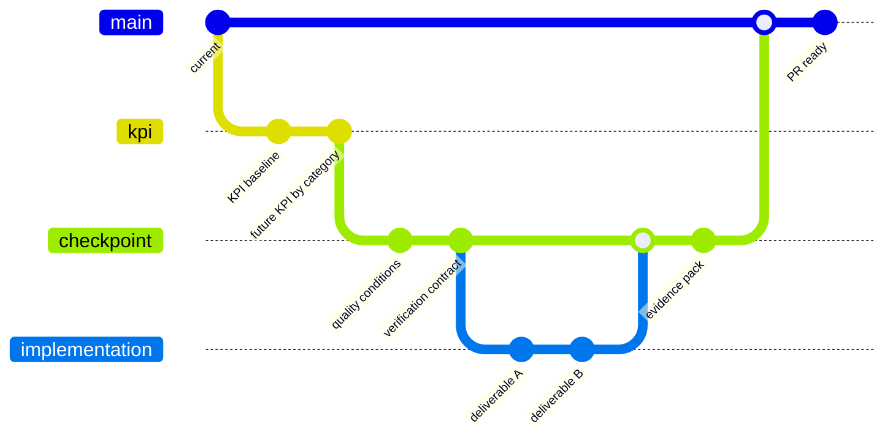

# KPI Backcast Roadmap

Use this when the task needs clear implementation KPIs, multi-step delivery,
category-level checkpoints, or schedule discipline. The goal is to turn a
future outcome into measurable quality conditions, concrete deliverables, and a
dependency-aware schedule.

Do not invent aspirational KPIs. Start from current repo truth, user outcome,
available evidence, and realistic constraints.

## Current Baseline

- Task:
- Current state:
- Known constraints:
- Known unknowns:
- Evidence used for baseline:

## Future KPI By Category

| Category | Future KPI | Current Baseline | Measurement | Evidence Path | Owner/System | Confidence |
|---|---|---|---|---|---|---|
| | | | | | | high/medium/low |

## KPI Reality Check

| KPI | Why It Is Realistic | What Would Make It Fake/Aspirational | Source Or Evidence |
|---|---|---|---|
| | | | |

## Roadmap Graph

Use a graph shape even when rendering Mermaid is not available. Keep branch
names artifact-oriented, not person-oriented.



## Checkpoint Conversion

Convert KPI targets into `quality_conditions`. Each condition must have a
minimum OK line and verification evidence. The checkpoint is not the whole
issue goal; it is the next quality line before continuing.

| KPI | Quality Condition ID | Condition | Minimum OK Line | Verify Command Or Method | Evidence Path |
|---|---|---|---|---|---|
| | qc-001 | | | | |

Example CLI conversion:

```bash
scripts/harness/backcast-checkpoint.sh <task-id> \
  --goal "<issue goal>" \
  --current "<current baseline>" \
  --target "<next quality checkpoint>" \
  --condition "qc-001::<condition>::<minimum OK line>::verify" \
  --command "verify::<test or check command>" \
  --allowed "src/**"
```

## Task Breakdown By Deliverable And Destination

| Category | Task | Deliverable | Destination | Depends On | Done Evidence |
|---|---|---|---|---|---|
| | | | repo/docs/tests/PR/evidence pack | | |

## Schedule

Keep schedules realistic. Use order, dependency, and exit condition rather than
calendar certainty when exact dates are unknown.

| Order | Timebox | Work | Depends On | Exit Condition | Evidence |
|---|---|---|---|---|---|
| 1 | | | | | |

## Plan Inputs

- Plan sections affected:
- Verification contract entries to add:
- Backcast checkpoint command(s) to run:
- S/M/L impact:

## Calibration

- Roadmap confidence:
- KPI most likely to slip:
- Dependency most likely to block:
- What would require re-planning:
